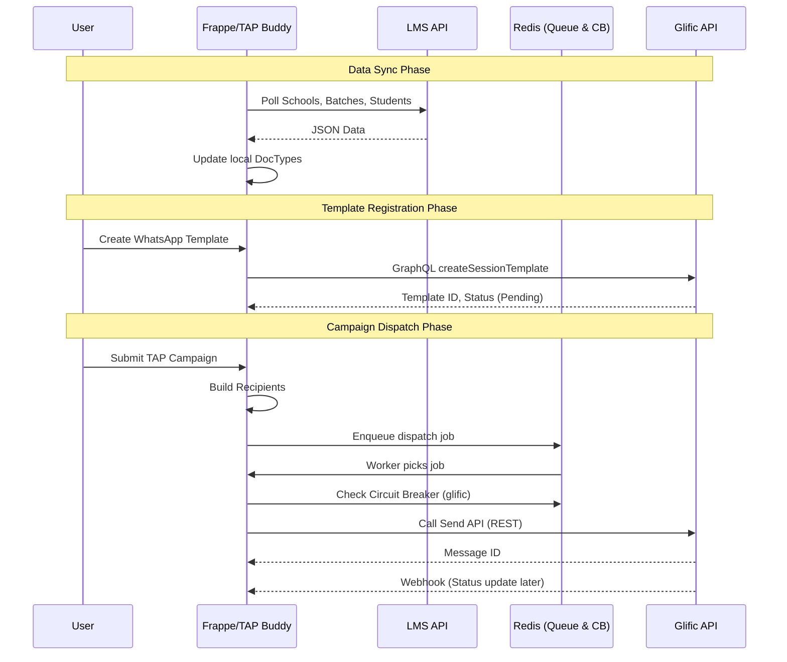

**TAP Bench — Application Architecture and Runbook**

This document describes the architecture, components, data flows, important files, and run/test instructions for the TAP Bench workspace (TAP Buddy + Frappe). It is intended to be consumed by engineers or an LLM to understand the whole system.

**Overview:**
- **Purpose:** TAP Buddy is an event-driven LMS-triggered WhatsApp automation platform built as a Frappe app. The workspace contains a top-level bench layout with core `frappe` framework and `tap_buddy` app under `apps/`.
- **Repo layout (short):** top-level bench and config files; `apps/frappe` (framework), `apps/tap_buddy` (application). Tests and UI specs live in `apps/frappe/cypress` and `apps/tap_buddy/ui_test`.

**High-level architecture**

```mermaid
flowchart LR
  Browser[User Browser / UI] -->|Form submit / Setup| FrappeServer[Frappe App Server]
  FrappeServer -->|Sync Data & Submit Campaign| TapBuddyApp[apps/tap_buddy]
  TapBuddyApp -->|Build Recipients / Sync LMS| DB[(PostgreSQL)]
  TapBuddyApp -->|Enqueue dispatch / tasks| Redis[Redis Queue]
  Redis -->|Worker| Dispatcher[Background Worker]
  Dispatcher -->|Send API calls| Glific[Glific (WhatsApp API)]
  Glific -->|Webhook (Delivery Status)| FrappeServer
  ExternalLMS[LMS API] -->|Poll / Sync (Student, School, Batch)| TapBuddyApp
  TapBuddyApp -->|Register HSM Templates| Glific
  Note[Circuit breaker protects Glific API limits]
```

**Components & responsibilities**
- `apps/frappe`: the Frappe Framework. Provides routing, DocTypes, REST API, scheduler, and test harness.
- `apps/tap_buddy`: the TAP Buddy app. Implements DocTypes (TAP Campaign, Campaign Recipient, Message Log, WhatsApp Template, LMS Student, School, Batch), background tasks, recipients builder, Glific integration, LMS data synchronization, and webhooks.
- Redis: job queue for background dispatch (`frappe.enqueue` / RQ workers) and implements the **Circuit Breaker** pattern to protect external APIs like Glific.
- PostgreSQL (bench site DB): stores DocType records.
- Glific: external WhatsApp provider (REST and GraphQL APIs). Used to register HSM templates, send messages, and return delivery updates via webhook.
- Cypress: UI tests located under `apps/tap_buddy/tests/ui/` (e.g. `hsm_template_e2e_spec.js`) that drive the UI for E2E validation.

**Primary data flows**

1) **LMS Sync & Event Automation Flow:**
   - Background jobs (Scheduler) or manual triggers call LMS Sync services (`lms_school_sync.py`, `lms_batch_sync.py`, `lms_student_sync.py`).
   - Data is fetched from `lms.evalix.xyz` (Schools, Batches, Students).
   - TAP Buddy creates/updates internal DocTypes and links them (e.g., linking Student to School and Batch).
   - Event mapping can trigger automated WhatsApp campaigns based on LMS data changes.

2) **HSM Template Creation Flow:**
   - User creates a `WhatsApp Template` in the TAP Buddy UI.
   - `glific_template_service.py` is invoked to push the template to Glific via GraphQL (`createSessionTemplate`).
   - The Frappe record is updated with `glific_db_id` and `glific_push_status` (PENDING/APPROVED).

3) **Campaign Lifecycle (Queue-first pattern):**
   - User creates `TAP Campaign` (Draft) via UI or API, selecting an approved `WhatsApp Template`.
   - On submit: `tap_buddy` builds recipients (creates `Campaign Recipient` records) and enqueues a dispatch job (status transitions to `Queued`).
   - Background worker picks up the job, sends messages to Glific, creates Message Log entries, and updates `Campaign Recipient` status.
   - Webhook from Glific updates delivery/read status in `Campaign Recipient` and Message Log.

**Sequence diagram (HSM Template & Dispatch)**



**Key files and where to look**
- **External Integrations:**
  - `apps/tap_buddy/tap_buddy/services/glific_client.py` — Core Glific API client (REST/GraphQL, Auth, Token refresh, Circuit Breaker).
  - `apps/tap_buddy/tap_buddy/services/glific_template_service.py` — HSM Template push & test send APIs.
  - `apps/tap_buddy/tap_buddy/services/lms_student_sync.py`, `lms_school_sync.py`, `lms_batch_sync.py` — LMS data synchronizers.
  - `apps/tap_buddy/tap_buddy/services/redis_utils.py` — Distributed locks, rate limiting, and Circuit Breaker logic.
- **DocTypes & Controllers:**
  - `apps/tap_buddy/tap_buddy/doctype/whatsapp_template/` — WhatsApp Template model (tracks Glific status, language, category).
  - `apps/tap_buddy/tap_buddy/doctype/tap_campaign/tap_campaign.py` — Campaign dispatch coordination.
  - `apps/tap_buddy/tap_buddy/api/webhook.py` & `lms_webhook.py` — Webhook handlers (Glific / LMS).
- **Client code & tests:**
  - `apps/tap_buddy/tap_buddy/tests/ui/hsm_template_e2e_spec.js` — Cypress E2E test for template creation & real Glific sending.
- **Devops / bench commands:**
  - `bench` CLI used from top-level bench directory.

**Run and development instructions**

Prerequisites:
- Python (3.14 used in env), Node 18.x, npm/yarn, Redis, PostgreSQL, `bench` installed.

Quick local setup:
```bash
source env/bin/activate
bench start                       # runs redis, workers, and webserver
```

Run Cypress UI tests (headless):
```bash
# Example for the HSM Template E2E Flow
export NVM_DIR="$HOME/.nvm" && . "$NVM_DIR/nvm.sh" && nvm use 18
cd apps/tap_buddy
npx cypress run --spec "tap_buddy/tests/ui/hsm_template_e2e_spec.js" --config baseUrl=http://tapbuddy.local:8000
```

Operational checks:
- Monitor Redis Circuit Breaker: `redis-cli -p 13000 GET tap_buddy:cb:glific`
- Check pending recipients in DB.

**Testing notes & troubleshooting**
- **Glific Auth (401 errors):** If Cypress tests pass but messages aren't delivered, the Glific token might be expired. Refresh it by calling the session API or updating `TAP Buddy Settings`.
- **Circuit Breaker:** If Glific fails repeatedly, the circuit breaker opens. Clear the redis key `tap_buddy:cb:glific` to reset it.
- **Cypress failures:** Ensure you are using `http://tapbuddy.local:8000` as the baseUrl and that credentials in `TAP Buddy Settings` are valid.

**Where to read more**
- Detailed Architecture Map: `docs/ARCHITECTURE_DETAILED.md`
- Frappe docs: https://docs.frappe.io/framework

---
Generated: 2026-05-29 — maintain and update as code evolves.
